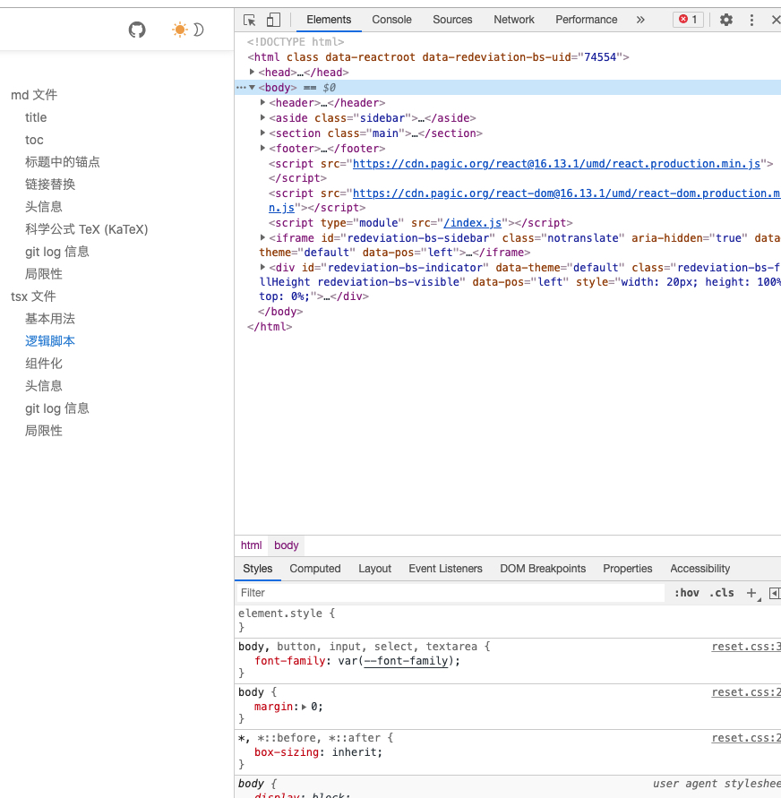
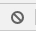
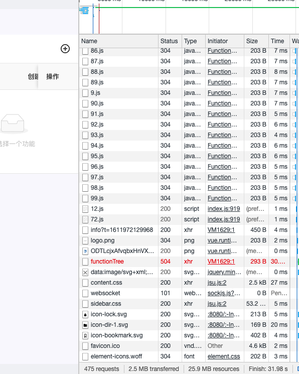
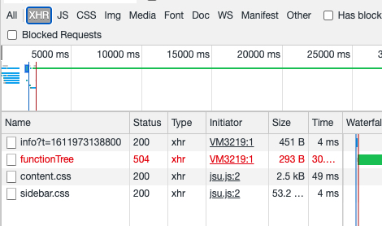
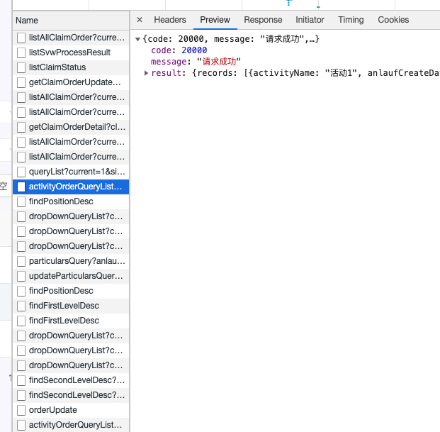
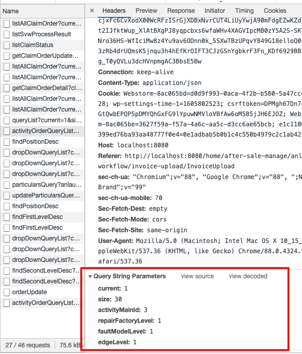

# 一些快速定位页面问题的技巧

## 1. 测试环境

### 使用测试环境测试而非本地搭建前端环境进行测试

前端配置已更新,使用测试环境测试无需每次前端更新代码后 ctrl f5 强制刷新页面

## 2. 浏览器开发者工具

### 想要初步定位错误，可以先F12打开 chrome 的 devtool，别的浏览器也一样

### 浏览器 devtool

- 就是这个:

前端成员外定位 bug 所需要关注的基本是两块地方的内容

1. Console

2. Network

这两个标签页点  可以清空信息

network 下面的信息需要刷新页面前打开 devtool 有请求才会显示数据，一般是这样

如果没有信息，就请 F5 刷新页面

可以看到上面图片浏览器请求的资源非常多，看起来不方便，可以点击上方的 XHR, 只查看我们需要的内容

## 3. 错误定位

### Message 信息

- 项目的 Message 信息，也就是请求成功或者失败时的弹窗，是可以用来定位错误的，之前在群里说的后端需要返回准确的 Message 信息目的也是能尽快定位错误，而不是一个错误要定位半天

- 项目中的红框提示基本可以分成三种:

    1. 服务端错误:

        - 此时一般可以判断为后端问题，至少有此类错误没有对应的报错这个问题
        - 除此之外，有可能是前端传错参数，一般需要后端查看日志判明什么参数没传

    2. http lose

        - 此時需要 f12 按上述图片中方式打开 devtool, 查看 xhr 中红色的请求，查看其 status

            - status 为 500, 一般为后端无响应，容器崩溃或重启，与代码无关, 可在下述的 preview 中查看是否有错误提示信息

            - status 为 504, 超时，不一定和代码有关，需把情况反馈给后端

            - status 为 404, 前端请求路径错误
    
            - status 为 401/403 此为鉴权错误，一般是密码输错，也不排除后端代码修改导致

            - status 为 40X（最后一位是4以外的数）, 点击这个飘红的请求，右侧会弹出页面（下图为正常的请求，仅作示例）

          

            - 点击 preview, 查看其中的 message
                1. 如有 xxxx input 'xxxx(字段名)' 类似格式的错误，一般可判明为参数错误，此时点击图中 headers, 滚动条拉到最下方 可以看到前端上传的参数
                2. 413 Request Entity Too Large, 超出上传限制，一般为后端或 nginx 限制，nginx 可联系前端修改
                3. 待完善

          

    3. 有明确的错误提示时，根据错误提示即可八九不离十判断到底是哪边出错
    
        - 提示 GENERAL，后端服务崩溃

### 点击按钮无反应，页面点任何地方都无响应

- 打开 devtool, 查看 console 中是否有红色错误，截图发给前端（没有红色报错为校验出错，一般有黄色的警告）
